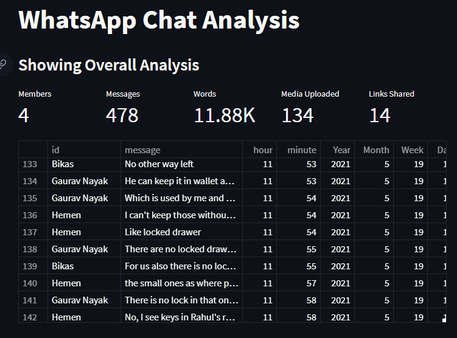
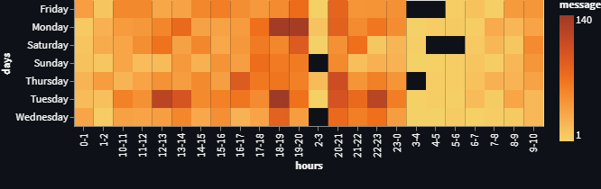
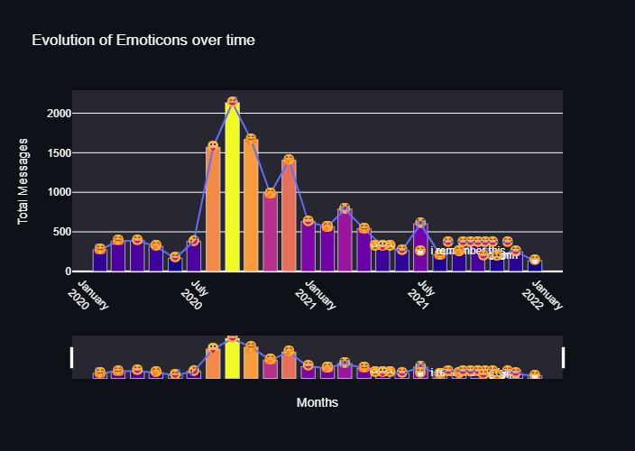
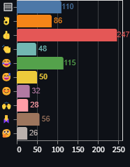
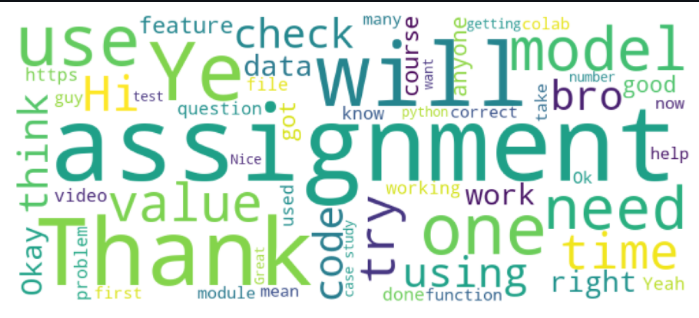
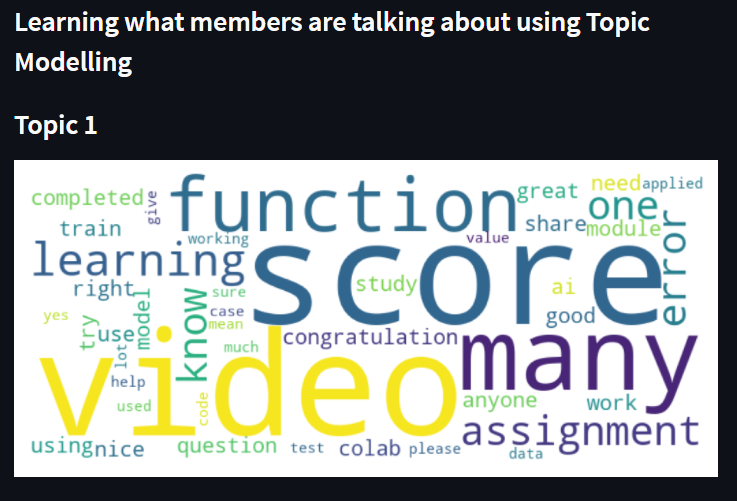

# Topic Modelling and Visualization of WhatsApp Conversations

A web app to visualize metrics of any one-to-one and group conversations in WhatsApp. To get started, export a WhatsApp conversation from your phone, and upload it in the app.

## Deployment
Project is deployed in heroku at [https://chatresults.herokuapp.com/](https://chatresults.herokuapp.com/)

## Plots
Get a glimpse of overall conversations and summary metrics, or select particular group members to see their conversation statistics.

Visualize when members are most active.

Visualize most used emojis, and they evolve over time

Natural Language Processing of Conversations

Prediction of topics

